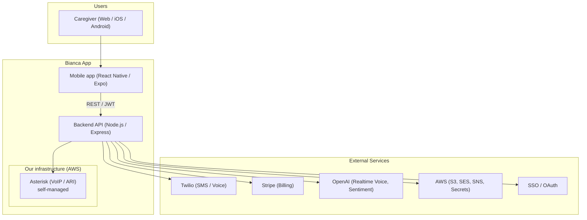
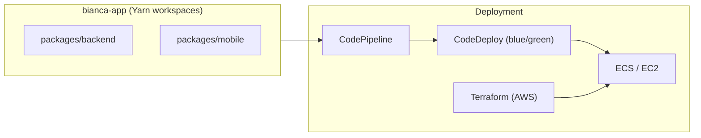
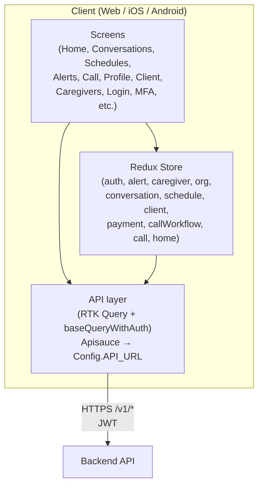
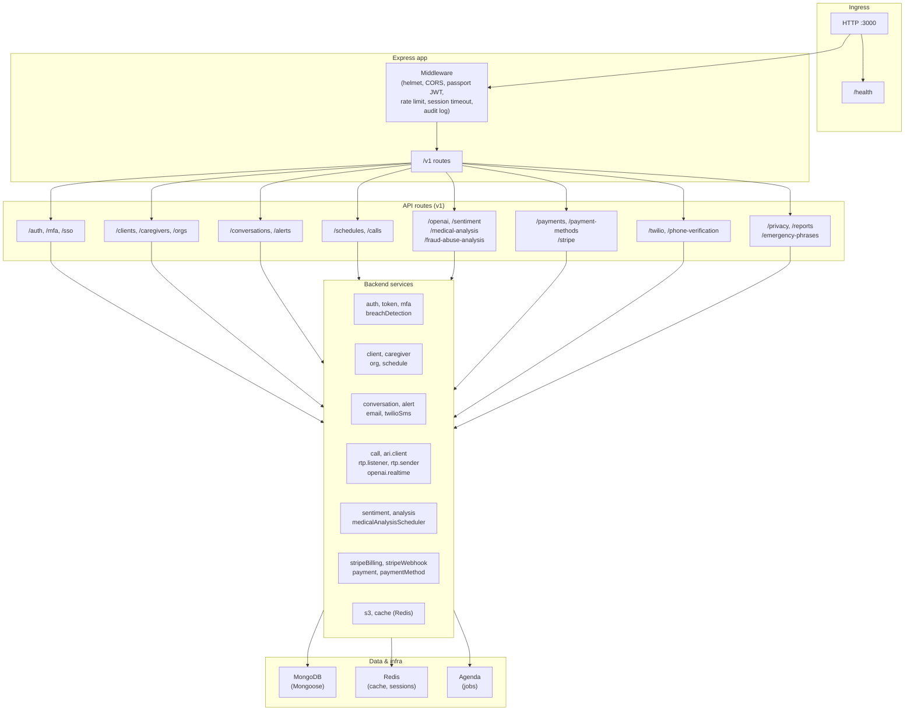
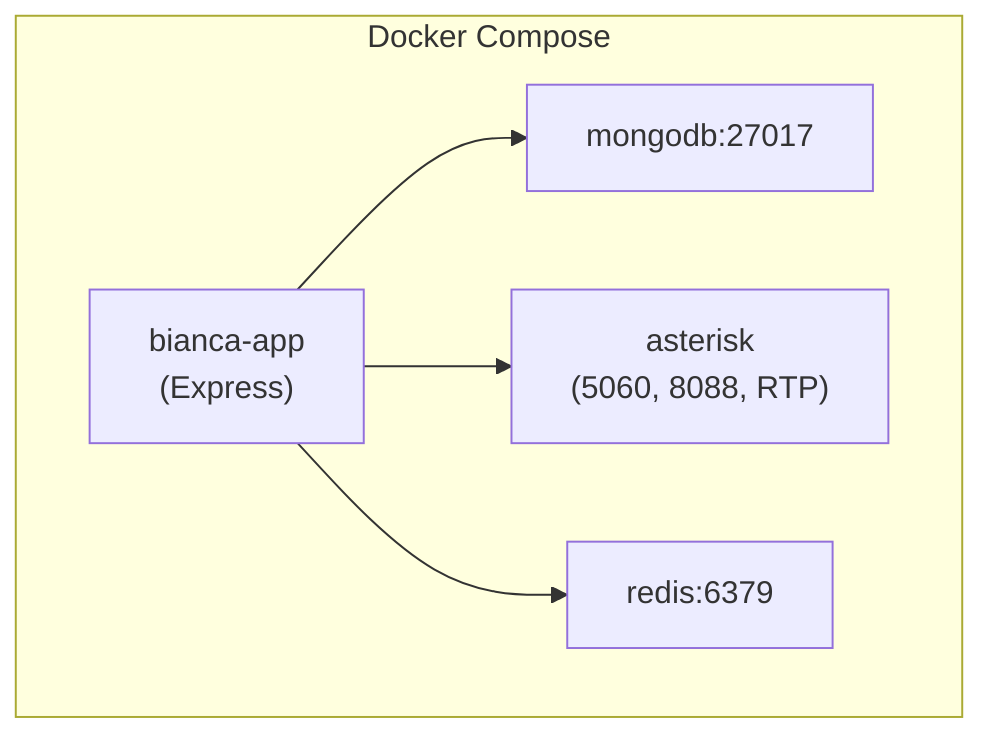

# Bianca App — Architecture Diagram

High-level architecture for **Bianca Wellness** (MyPhoneFriend): a secure healthcare communication platform for caregivers and wellness monitoring (HIPAA-oriented).

---

## System context



---

## Monorepo & deployment



---

## Mobile app architecture



---

## Backend architecture



---

## Voice & AI pipeline

```mermaid
flowchart LR
  subgraph client["App"]
    CallScreen["Call screen"]
  end

  subgraph backend["Backend"]
    CallWorkflow["callWorkflow\ncontroller"]
    ARI["ari.client\n(Asterisk ARI)"]
    RTP["rtp.listener\nrtp.sender"]
    OpenAIRealtime["openai.realtime\n(WebSocket)"]
  end

  subgraph our_infra["Our infrastructure (AWS)"]
    Asterisk["Asterisk\n(PJSIP, RTP)\nself-managed"]
  end

  subgraph external["External"]
    OpenAI["OpenAI\nRealtime API"]
  end

  CallScreen -->|"REST /v1/calls"| CallWorkflow
  CallWorkflow --> ARI
  ARI <-->|"ARI WebSocket"| Asterisk
  Asterisk <- ->|RTP| RTP
  RTP <--> OpenAIRealtime
  OpenAIRealtime <-->|"WebSocket"| OpenAI
```

**Scaling note:** Asterisk currently runs in Docker on the same EC2 as the app (pilot). Self-hosted voice compute becomes the dominant AWS platform cost at large resident counts; see `packages/backend/docs/deployment/ASTERISK_SCALING.md`.

---

## Docker (local dev)



---

## Key technologies

| Layer        | Technologies |
|-------------|--------------|
| Mobile app  | React Native, Expo 50, Redux Toolkit, RTK Query, TypeScript |
| Web (desktop) | Vite, React 18, shared design tokens (`@bianca-app/shared`) |
| Backend     | Node.js, Express, Passport JWT, Mongoose, Agenda |
| Data        | MongoDB, Redis |
| Voice       | Asterisk (ARI, self-managed on AWS), Twilio, OpenAI Realtime API, RTP |
| AI          | OpenAI (sentiment, medical/fraud-abuse analysis), LangChain |
| Billing     | Stripe (subscriptions, webhooks, usage) |
| AWS         | S3, SES, SNS, Secrets Manager |
| DevOps      | Terraform, CodePipeline, CodeDeploy, Docker |

---

## Security & compliance (HIPAA-oriented)

- **Auth:** JWT, MFA (TOTP), SSO/OAuth, session timeout
- **Audit:** Audit logging for PHI access
- **Policies:** Rate limiting (auth), minimum-necessary middleware, breach detection
- **Data:** Mongo sanitization, XSS clean, CORS allowlist

